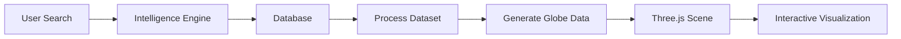

<div align="center">

# 🌍 Lumina

### Interactive 3D Global Intelligence & Supply Chain Visualization Platform

**A high-performance geospatial web application for exploring global supply chains, trade intelligence, and market insights through interactive 3D visualizations.**

---


---

**Live Demo • Documentation • Architecture**

</div>

---

# Overview

Lumina is a modern geospatial intelligence platform that transforms complex global datasets into interactive 3D experiences.

The application combines WebGL rendering, real-time data visualization, cinematic storytelling, and spatial analytics to help users explore global supply chains, production hubs, trade routes, and country-specific intelligence through an intuitive globe-based interface.

Built with modern frontend technologies, Lumina emphasizes performance, modular architecture, and immersive user experience.

---

# Features

## 🌎 Interactive 3D Globe

- Real-time globe rendering
- Interactive hotspots
- Animated trade routes
- Atmospheric effects
- Smooth camera navigation

---

## 🔍 Global Intelligence Search

Search topics including:

- Semiconductors
- Lithium
- Coffee
- AI Engineers
- Rare Earth Minerals
- Manufacturing Hubs

Each search dynamically updates:

- Globe markers
- Trade routes
- Intelligence panels
- Country insights
- Market statistics

---

## 🎬 Story Mode

Guided documentary-style exploration featuring:

- Cinematic camera movement
- Animated transitions
- Sequential storytelling
- Dynamic subtitles
- Automated scene navigation

---

## 📊 Data Visualization

- Production Heatmaps
- Demand Heatmaps
- Export Networks
- Import Networks
- Growth Indicators
- Opportunity Mapping

---

## 🌍 Country Intelligence

Explore individual countries with:

- Economic profile
- Technology ecosystem
- Supply chain role
- Market statistics
- Strategic importance

---

# Tech Stack

| Layer | Technologies |
|--------|--------------|
| Framework | React 19 |
| Language | TypeScript |
| Build Tool | Vite |
| 3D Rendering | Three.js |
| React 3D | React Three Fiber |
| Globe Engine | React Globe GL |
| Animation | Framer Motion, GSAP |
| Icons | Lucide React |
| Styling | CSS3 |
| Data Storage | IndexedDB |

---

# Architecture

```text
                        User
                         │
                         ▼
                 React Application
                         │
      ┌──────────────────┼──────────────────┐
      │                  │                  │
      ▼                  ▼                  ▼
 Search Engine     Story Engine      Globe Renderer
      │                  │                  │
      └──────────────┬───┴──────────────┬───┘
                     ▼                  ▼
             Intelligence Engine   Three.js Scene
                     │                  │
                     └──────────┬───────┘
                                ▼
                      Interactive Globe
```

---

# Project Structure

```text
src
│
├── components
│   ├── Globe
│   ├── UI
│   └── Shared
│
├── services
│   ├── Data Intelligence Engine
│   ├── Narrative Engine
│   ├── Country Intelligence
│   └── Database
│
├── assets
│
├── utils
│
├── App.tsx
└── main.tsx
```

---

# Application Flow



---

# Core Components

## Globe Engine

Responsible for:

- Globe rendering
- Camera animation
- Arc generation
- Marker rendering
- Country highlighting

---

## Narrative Engine

Controls:

- Story mode
- Camera timeline
- Documentary sequences
- Animated navigation

---

## Intelligence Engine

Handles:

- Topic search
- Dataset retrieval
- Trade information
- Country metadata
- Comparison datasets

---

## Database Layer

- IndexedDB
- Dynamic topic loading
- Offline persistence
- Search indexing

---

# Engineering Highlights

- Component-based architecture
- Type-safe development with TypeScript
- Modular service layer
- Separation of UI and business logic
- Reusable visualization components
- Responsive layouts
- GPU-accelerated rendering
- IndexedDB persistence
- Smooth animation pipeline
- Optimized rendering lifecycle

---

# Performance

Designed with performance in mind:

- Lazy-loaded components
- Efficient React rendering
- GPU-accelerated graphics
- Memoized computations
- Modular state management
- Optimized animation loops

---

# Installation

Clone the repository

```bash
git clone https://github.com/yourusername/lumina.git
```

Install dependencies

```bash
npm install
```

Start development server

```bash
npm run dev
```

Build production version

```bash
npm run build
```

---

# Future Enhancements

- Live economic APIs
- Satellite imagery integration
- AI-powered trade forecasting
- Multi-user collaboration
- Exportable analytics
- Time-series playback
- WebGPU rendering
- Cloud synchronization

---

# Design Philosophy

Lumina was built to explore how modern web technologies can make complex global datasets more intuitive through immersive visualization.

Rather than presenting information as static dashboards, the platform transforms data into an interactive spatial experience where users can navigate, explore, and understand relationships between countries, industries, and supply chains.

---

# License

MIT License
